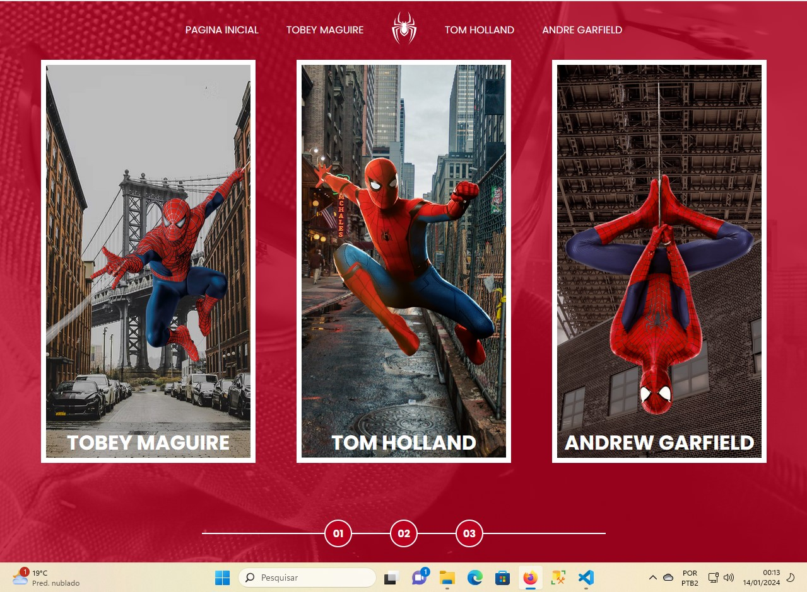

# Multiverso Spider-Man: Criando um Site com HTML, CSS e JavaScript

Objetivo: O objetivo deste projeto prático hands-on é ensinar os participantes a criar um site interativo utilizando as tecnologias HTML, CSS e JavaScript, com foco no aprendizado e aplicação dos principais efeitos de CSS. O tema do site será o multiverso do Spider-Man, proporcionando uma experiência divertida e envolvente aos usuários.

Descrição: Neste projeto, será explorado o uso dos principais efeitos de CSS, como transições, animações, transformações e estilos avançados, para criar um layout rico e impressionante baseado no universo do Spider-Man. Os participantes aprenderão técnicas avançadas de posicionamento de elementos em tela, utilizando a sobreposição de blocos e o domínio da arte de compor itens em tela.

Requisitos técnicos:
- Conhecimento básico de HTML, CSS e JavaScript.
- Plataforma de desenvolvimento web (como Visual Studio Code, Sublime Text, etc.)

### Orientadora Michele Ambrosio  DIO
